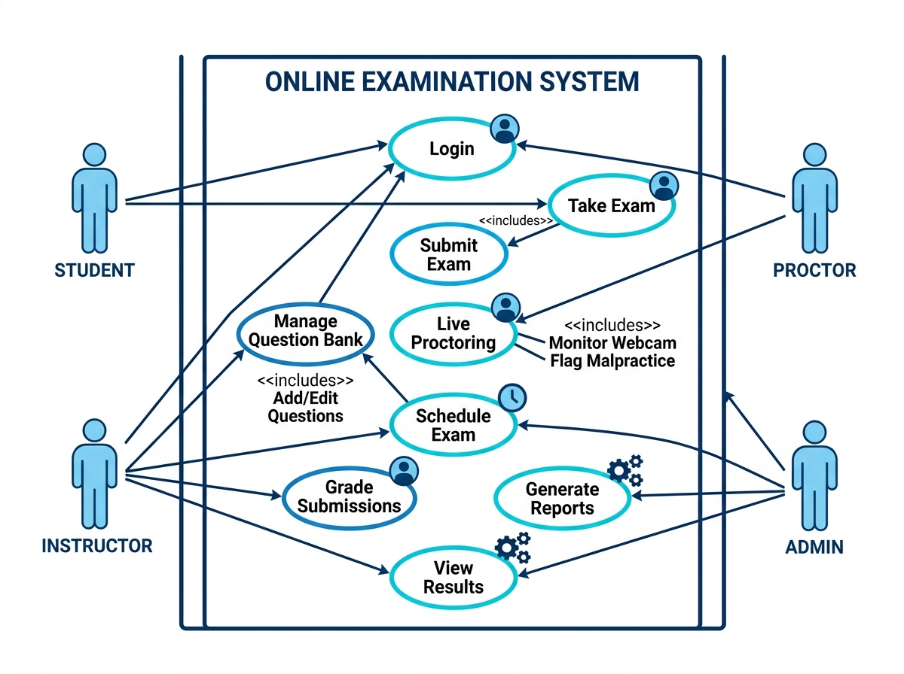
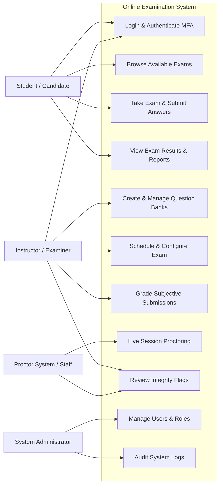
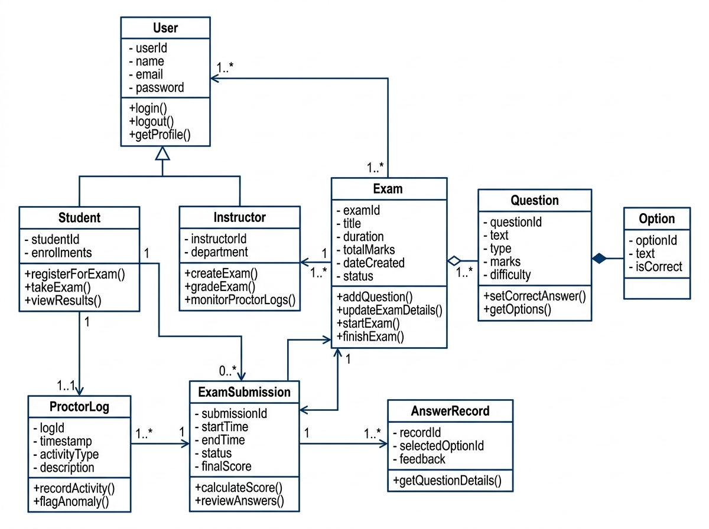
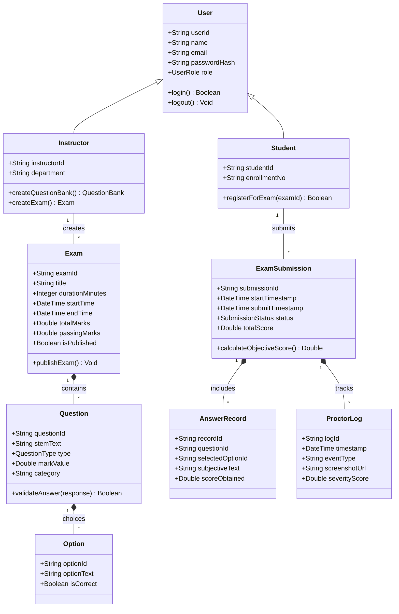
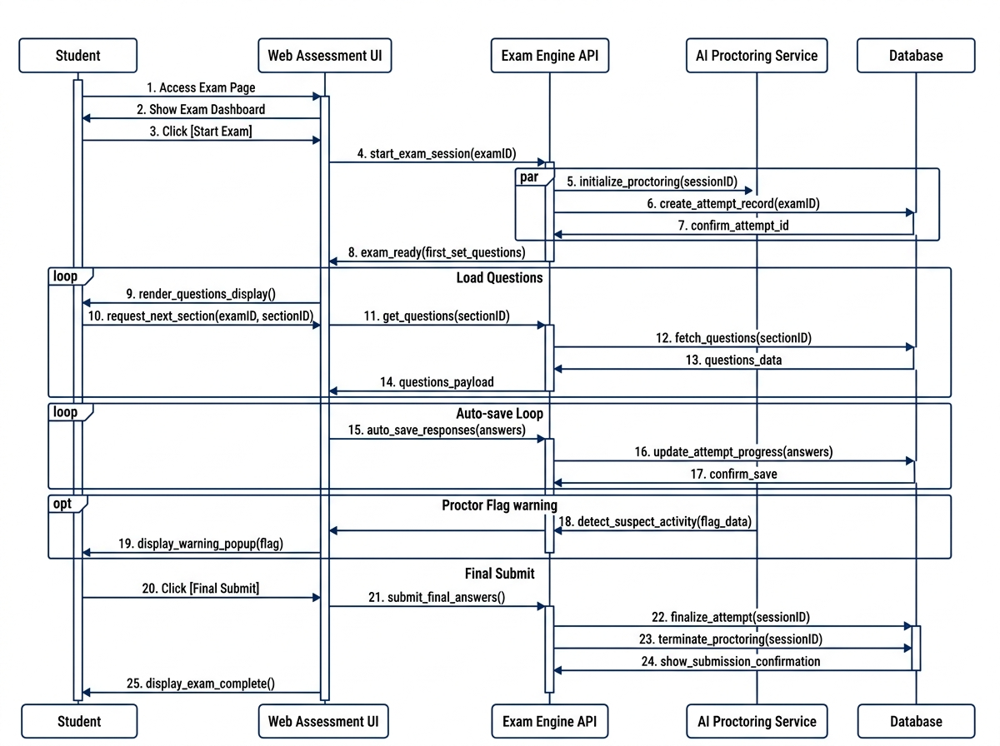
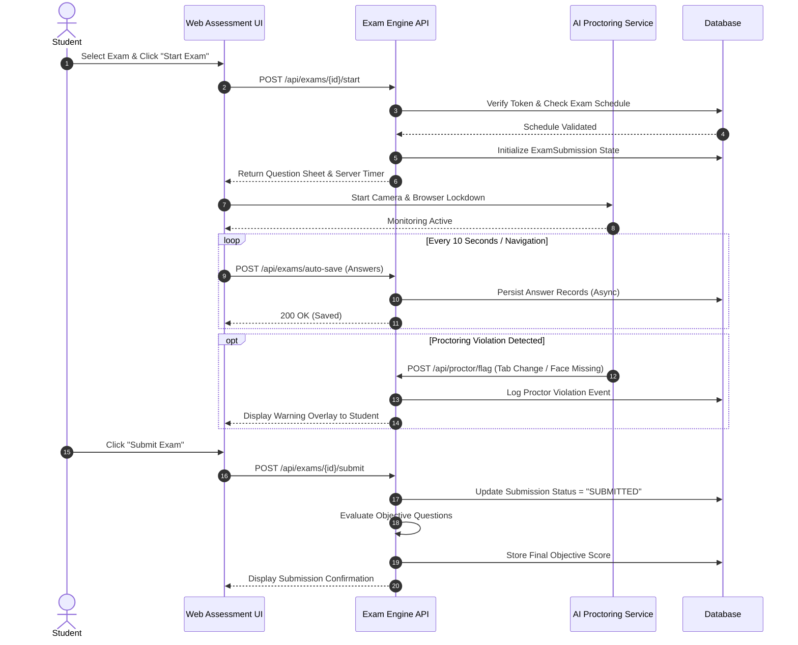
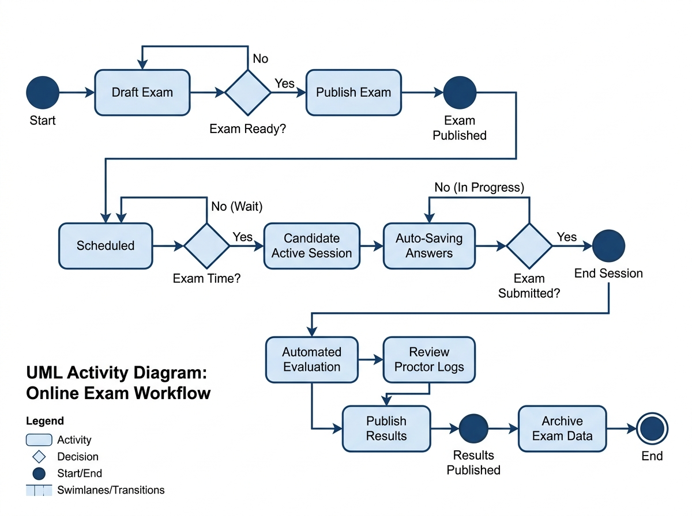
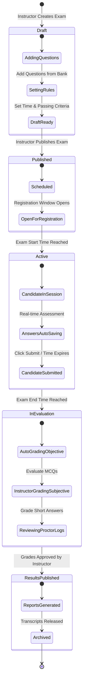

# System Architecture & UML Diagrams
## Online Examination Process System

This document provides four comprehensive UML diagrams representing the structural, behavioral, and lifecycle aspects of the system.

---

## 1. Use Case Diagram

The Use Case diagram below models the interactions between system actors (Student, Instructor, Proctor, Administrator) and the core capabilities within the Online Examination System boundary.

---

## 2. Class Diagram

The Class Diagram defines the object-oriented structure, domain models, entity relationships, attributes, and key methods.

---

## 3. Sequence Diagram

The Sequence Diagram details the real-time interaction flow between a Student, the Client Web App, the Examination Engine, Proctoring Service, and Database during an active assessment session.

---

## 4. State / Activity Diagram

The State Diagram illustrates the complete lifecycle states of an Examination within the system, from creation to final grading and archiving.

